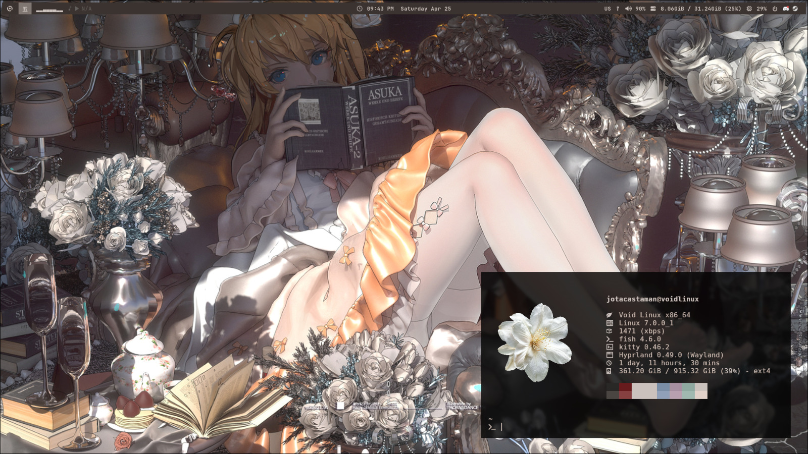

# 🌸 dotfiles

> My personal configuration files for my Void Linux setup.

---

## 💻 System

| Category | Software |
|----------|----------|
| OS | [Void Linux](https://voidlinux.org) (Wayland) |
| Window Manager | [Hyprland](https://hyprland.org) |
| Greeter | [SDDM](https://github.com/sddm/sddm) |

## 🖥️ Terminal & Editor

| Category | Software |
|----------|----------|
| Terminal | [Kitty](https://sw.kovidgoyal.net/kitty) |
| Shell | Bash |
| Editor | [Neovim](https://neovim.io) / [Zed](https://zed.dev) |
| File Manager | [Ranger](https://ranger.github.io) / [Nemo](https://github.com/linuxmint/nemo) |

## 🎨 Theming

| Category | Software |
|----------|----------|
| Bar | [Waybar](https://github.com/Alexays/Waybar) |
| Launcher | [Rofi](https://github.com/davatorium/rofi) |
| Icons | [Papirus Dark](https://github.com/PapirusDevelopmentTeam/papirus-icon-theme) |
| Font | [JetBrains Mono Nerd Font](https://www.nerdfonts.com) |

## 🌐 Apps

| Category | Software |
|----------|----------|
| Browser | [Firefox](https://www.firefox.com/en-US/) |
| VPN | [Mullvad](https://mullvad.net) |
| Screen Recorder | [OBS Studio](https://obsproject.com) |
| Notes | [Mousepad](https://github.com/codebrainz/mousepad) |

---

## ⚠️ Installation Notes (Void Linux)

Hyprland is not available in Void's official repositories. Current third-party options are:

- [Makrennel/hyprland-void](https://github.com/Makrennel/hyprland-void) — original repo, apparently abandoned
- [Encoded14/void-extra](https://github.com/Encoded14/void-extra) — active alternative
- [Event-Horizon-VL/blackhole-vl](https://github.com/Event-Horizon-VL/blackhole-vl) — community-driven, better organized

> ⚠️ Prebuilt binaries from these repos may be outdated relative to Void's current
> libraries (known issue with `libhyprutils` soname mismatch).
> If you encounter an `unresolvable shlib` error, the solution is to build manually
> via `xbps-src` using the templates from blackhole-vl.
